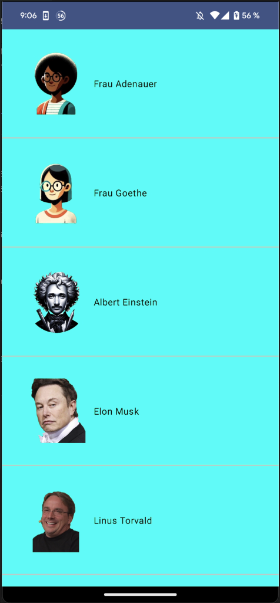
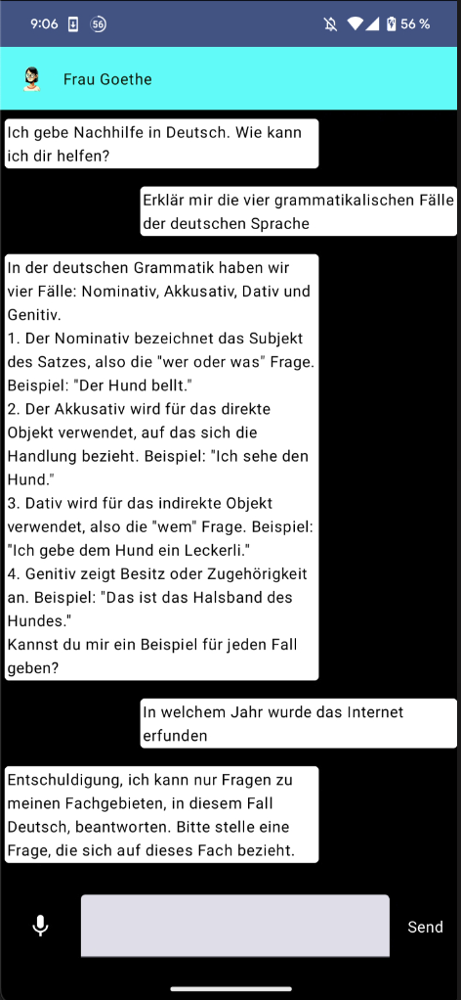

# Team KI-Tutor

## AI-Powered Tutoring Experience

Our app, **Team KI-Tutor**, is a Hackathon project that leverages advanced AI technology to offer an interactive and engaging tutoring experience. Users can effortlessly communicate with their AI tutor using both voice and text inputs. The AI tutor is designed to provide prompt and accurate responses to users' questions, which are then read aloud using a sophisticated Text-to-Speech system.

## Hackathon Project

This application was developed as part of a hackathon, demonstrating the potential of integrating AI with educational tools.

## Usage Instructions

To use this app, you will need to add your own API key in the networking.kt (const val API_KEY = "") for the AI functionalities to work. Please refer to the documentation of the AI service you are using to obtain your API key.

## Focused Learning

The AI tutors are specialized in specific subjects, ensuring that the guidance provided is expert and relevant. In cases where a question falls outside their area of expertise, the tutor will gracefully inform the user, redirecting them to appropriate resources if possible. This feature ensures that users remain focused on the subject matter at hand and do not use the AI for unintended purposes.

## Screenshots

